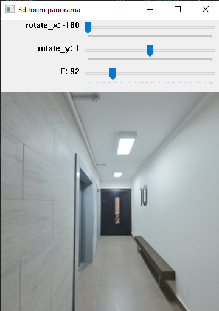

`3d_train.ipynb` - файл с ноутбуком

`main.py` - скрипт для запуска просмотра панорамы

заускать срипт нужно с аргументом (путь к файлу с изображением - равномерная цилиндрическая проекция)

Пример:
`python main.py --file_path data\image_1024_aligned_rgb.png`

